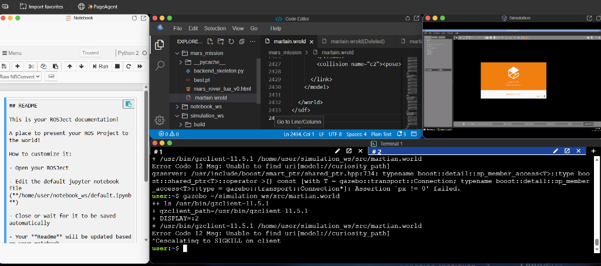
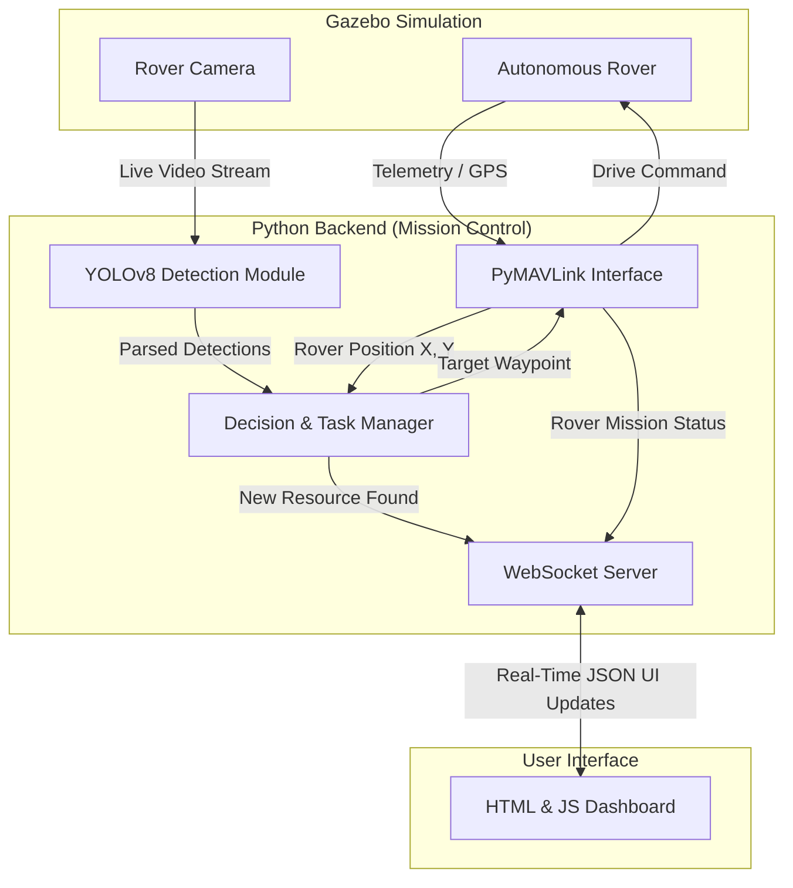

# TUA Hackathon: Mars Autonomous Exploration System

Welcome to the Al-Tech Mars Exploration project! This repository contains a fully automated, closed-loop AI software suite designed to autonomously identify critical Initial In-Situ Resource Utilization (ISRU) elements—such as Water Ice and Regolith—and deploy an autonomous rover to collect them. 

## 📸 Dashboard Interface

*(Real-time Interactive Web Dashboard connected to the backend via WebSockets. It tracks visual inferences, maps dynamic ISRU clusters, and actively assigns missions to autonomous rovers.)*

## 🚀 How The System Works (Data Flow Pipeline)
Our system connects a simulated physical rover with an AI brain and a UI in real-time. Here is the exact step-by-step logic loop running at all times:
1. **Sensors:** The simulated Rover drives around Gazebo while its downward camera captures live video at 30 FPS.
2. **AI Inference:** The video stream is routed into the `Vision Node` where our custom-trained YOLOv8 (`best.pt`) analyzes every frame for Water Ice and Regolith.
3. **Data Mapping:** When YOLO detects an object, it takes the object's pixel coordinates and mathematically adds them to the Rover's current GPS position (pulled instantly via `PyMAVLink`) to get the item's true Global X, Y coordinates on Mars.
4. **Deduplication:** The `Decision Logic` checks its memory. If this newly found Ice patch is within 2 meters of one we already know about, it ignores it. If it is brand new, it accepts it.
5. **Real-Time UI Update:** The second a new resource is accepted, the `FastAPI WebSocket Server` instantly pushes a JSON packet to the HTML Dashboard, dynamically drawing the resource dot onto the canvas map without the page reloading.
6. **Task Execution:** The `Priority Queue` sorts pending tasks based on ISRU value (Water Ice > Regolith). It picks the highest priority target, and sends the Global X, Y coordinates back through `PyMAVLink` as a "Drive To" command, guiding the Rover exactly to the spot.

## 🧠 System Architecture Diagram


## 📁 Repository Structure
* **`martian.world`**: A lightweight, robust Gazebo XML environment with dummy test objects (White cylinders = Ice, Brown spheres = Regolith). Very stable and safe for demonstrations.
* **`backend_skeleton.py`**: The central brain. Runs an Async FastAPI Web Server and WebSocket link while orchestrating YOLO vision and PyMAVLink paths.
* **`mars_rover_tua_v0.html`**: A natively served, JavaScript-powered interactive HTML Canvas map. No external libraries needed, lightning-fast telemetry visualization!
* **`best.pt`**: Our optimized YOLO model weights, trained specifically on Martian datasets.

## 🛠 Prerequisites & Installation
1. Install necessary Python packages:
```bash
pip install fastapi uvicorn websockets opencv-python ultralytics
```

## 🎮 How to Run
**Terminal 1: Start the simulated Mars World**
```bash
gazebo martian.world
```

**Terminal 2: Boot Mission Control**
```bash
python3 backend_skeleton.py
```
*Wait for the `Uvicorn running on http://0.0.0.0:8000` text.*

**View the Real-Time Dashboard:**
1. Click on The Construct's "Web Tools" or "Open Web Port" feature.
2. Select Port 8000.
3. Watch the real-time AI logic fill out your map automatically!
